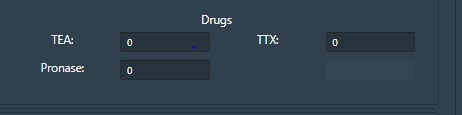

**Procedure to Work Simulator**
 

The experiment explains the role of Na+ channel in action potential initiation and understanding the dynamics of Na+ channels in detail.Na+ channel consists of activation and inactivation gates, both these gates regulate the ionic movement across the membrane.

&nbsp;

 

1.	Initially, select the current clamp mode in the experiment.
 

 &nbsp;

 Understanding parameters in the simulator window.

Cm  = Membrane Capacitance (nF)

Rm  = Membrane resistance (MΩ)

Vr  = Resting Voltage (mV)

T = Temperature (0C)	

F= Frequency

&nbsp;

 gNa = Conductance of Sodium ions

gK= Conductance of Potassium ions

gCl= Conductance of Chloride ions

&nbsp;

 Membrane window provides accesses to internal and external ionic concentration (Sodium, chloride and potassium) and membrane properties.

 &nbsp;

 &nbsp;

 Drug window helps to study the pharmacological effect in neuronal membrane by the application of three drugs TTX (Inhibit Na current), TEA (Inhibit K current), Pronase (eliminate Na+ inactivation).Drugs can be applied at any point of time. 

 &nbsp;

User can set varying values as input parameters. 

 &nbsp;

 T1 = Time (T1 start, suppose 10 s and T2 stop 20s). The simulator will read the output from 10s to 20s. Likewise T2 Start and T2 Stop can be given according to users choice. V1 and V2 indicates applied voltage at the specified time duration. 

 
 
 &nbsp;
 
 Click on run button to execute simulator.
 

 &nbsp;

 The output for the default values set in the simulator window is shown. User can change the parameters and can see how the varying parameters change the spiking properties of neurons. In the default parameters, drug concentration is not given. User can give different concentration of drugs, all the three drugs at the same time, or one by one and can study how the drugs affect ion channels. 

 
 &nbsp;

 For example, apply the value of TEA as 45% and TTX as 17%

 &nbsp;

 This plot indicates the effect of applied drugs in the ion channels. Here the addition of TTX inhibited Na+ current and TEA inhibited K+ current. 
 
  &nbsp;

Overall, changes in neuron permeability depend strictly on the opening and closing of ionic channels.
