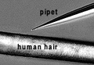
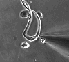
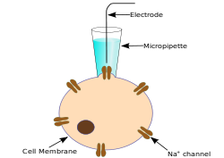
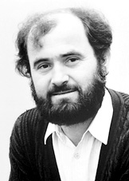

To measure what's happening in or on a single living cell, scientists use a technique called the patch clamp which requires an extremely fine pipette held tightly against the cell membrane

 

 
 By carefully heating and pulling a small glass or quartz capillary tube, a very fine pipette can be formed. When pulled by machine, the tip will be much smaller than a human hair and the opening on the end of the pipette may be only 1 micron (one-one thousandth of a millimeter) in diameter.
 
  

  
  

  
  The patch clamp technique is a laboratory technique in electrophysiology that allows the study of single or multiple ion channels in cells. The technique can be applied to a wide variety of cells, but is especially useful in the study of excitable cells such as neurons, cardiomyocytes, muscle fibers and pancreatic beta cells. It can also be applied to the study of bacterial ion channels in specially prepared giant spheroplasts. The patch clamp technique is a refinement of the voltage clamp.
  
  

  Erwin Neher 
  
 &nbsp;

Bert Sakmann
  
 &nbsp;

Erwin Neher and Bert Sakmann developed the patch clamp in the late 1970s and early 1980s. This discovery made it possible to record the currents of single ion channels for the first time, proving their involvement in fundamental cell processes such as action potential conduction. Neher and Sakmann received the Nobel Prize in Physiology or Medicine in 1991 for this work.

 

